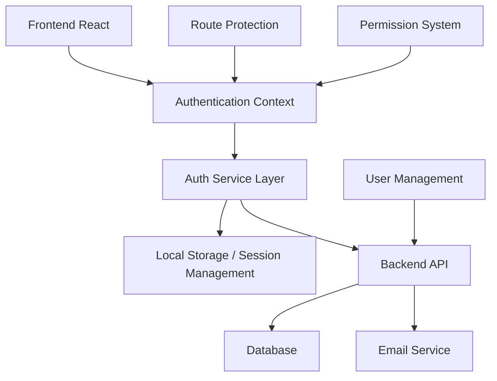
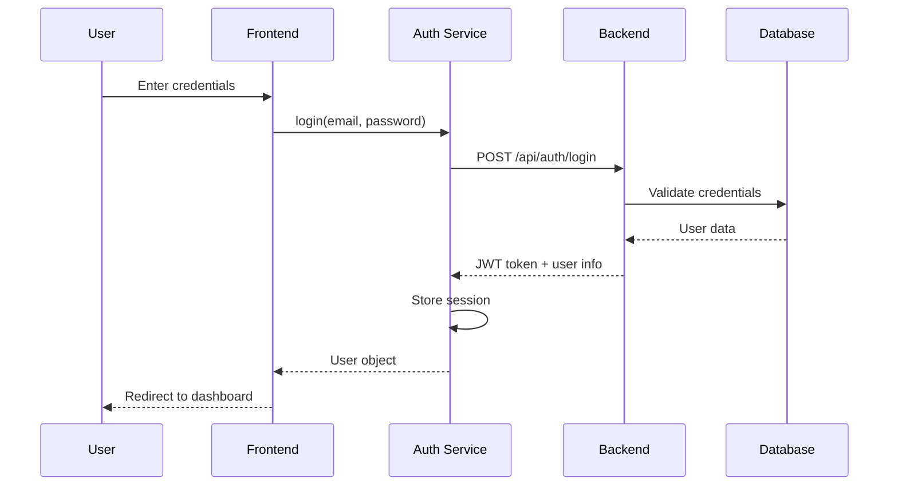

# Design Document

## Overview

O Sistema de Autenticação Local é projetado para fornecer uma solução completa de autenticação e autorização para o sistema de gestão de igrejas. O design foca em segurança, usabilidade e escalabilidade, suportando múltiplos perfis de usuário com diferentes níveis de acesso.

O sistema atual já possui uma base sólida com autenticação local para desenvolvimento, mas precisa ser expandido para incluir funcionalidades de produção como recuperação de senha, gestão de usuários, validações de segurança e auditoria.

## Architecture

### High-Level Architecture



### Authentication Flow



## Components and Interfaces

### 1. Authentication Context (Enhanced)

**Current State:** Basic context with login/logout functionality
**Enhancement Needed:** Add session management, password recovery, user management

```typescript
interface AuthContextType {
  // Current
  user: LocalUser | null;
  isAuthenticated: boolean;
  isLoading: boolean;
  login: (email: string, password: string, rememberMe?: boolean) => Promise<void>;
  logout: () => Promise<void>;
  
  // New additions
  forgotPassword: (email: string) => Promise<void>;
  resetPassword: (token: string, newPassword: string) => Promise<void>;
  updateProfile: (data: Partial<LocalUser>) => Promise<void>;
  changePassword: (currentPassword: string, newPassword: string) => Promise<void>;
  refreshToken: () => Promise<void>;
  sessionExpiry: Date | null;
  loginHistory: LoginActivity[];
}
```

### 2. User Management Interface

```typescript
interface UserManagementService {
  createUser: (userData: CreateUserData) => Promise<LocalUser>;
  updateUser: (id: string, userData: Partial<LocalUser>) => Promise<LocalUser>;
  deleteUser: (id: string) => Promise<void>;
  activateUser: (id: string) => Promise<void>;
  deactivateUser: (id: string) => Promise<void>;
  listUsers: (filters?: UserFilters) => Promise<LocalUser[]>;
  getUserById: (id: string) => Promise<LocalUser>;
  resetUserPassword: (id: string) => Promise<string>;
}
```

### 3. Security Validation

```typescript
interface SecurityService {
  validatePassword: (password: string) => ValidationResult;
  checkLoginAttempts: (email: string) => Promise<boolean>;
  recordLoginAttempt: (email: string, success: boolean, ip?: string) => Promise<void>;
  generateSecureToken: () => string;
  hashPassword: (password: string) => Promise<string>;
  verifyPassword: (password: string, hash: string) => Promise<boolean>;
}
```

### 4. Session Management

```typescript
interface SessionManager {
  createSession: (user: LocalUser, rememberMe: boolean) => SessionData;
  validateSession: (token: string) => Promise<SessionData | null>;
  refreshSession: (token: string) => Promise<SessionData>;
  destroySession: (token: string) => Promise<void>;
  cleanExpiredSessions: () => Promise<void>;
  getActiveSessions: (userId: string) => Promise<SessionData[]>;
}
```

## Data Models

### Enhanced User Model

```typescript
interface LocalUser {
  id: string;
  name: string;
  email: string;
  role: UserRole;
  avatar?: string;
  isActive: boolean;
  emailVerified: boolean;
  lastLogin?: Date;
  createdAt: Date;
  updatedAt: Date;
  preferences?: UserPreferences;
}

type UserRole = 'admin' | 'pastor' | 'lider' | 'tesoureiro' | 'voluntario' | 'membro';

interface UserPreferences {
  theme: 'light' | 'dark';
  language: string;
  notifications: NotificationSettings;
}
```

### Session Data Model

```typescript
interface SessionData {
  token: string;
  userId: string;
  expiresAt: Date;
  rememberMe: boolean;
  ipAddress?: string;
  userAgent?: string;
  createdAt: Date;
  lastActivity: Date;
}
```

### Login Activity Model

```typescript
interface LoginActivity {
  id: string;
  userId: string;
  email: string;
  success: boolean;
  ipAddress?: string;
  userAgent?: string;
  timestamp: Date;
  failureReason?: string;
}
```

### Password Reset Model

```typescript
interface PasswordReset {
  id: string;
  userId: string;
  token: string;
  expiresAt: Date;
  used: boolean;
  createdAt: Date;
}
```

## Error Handling

### Authentication Errors

```typescript
enum AuthErrorType {
  INVALID_CREDENTIALS = 'INVALID_CREDENTIALS',
  ACCOUNT_LOCKED = 'ACCOUNT_LOCKED',
  ACCOUNT_INACTIVE = 'ACCOUNT_INACTIVE',
  SESSION_EXPIRED = 'SESSION_EXPIRED',
  INSUFFICIENT_PERMISSIONS = 'INSUFFICIENT_PERMISSIONS',
  PASSWORD_REQUIREMENTS_NOT_MET = 'PASSWORD_REQUIREMENTS_NOT_MET',
  EMAIL_NOT_VERIFIED = 'EMAIL_NOT_VERIFIED',
  TOO_MANY_ATTEMPTS = 'TOO_MANY_ATTEMPTS'
}

interface AuthError {
  type: AuthErrorType;
  message: string;
  details?: any;
  timestamp: Date;
}
```

### Error Handling Strategy

1. **Client-Side Validation:** Immediate feedback for form validation
2. **Server-Side Validation:** Comprehensive security checks
3. **User-Friendly Messages:** Clear, actionable error messages
4. **Security Logging:** Log security events without exposing sensitive data
5. **Graceful Degradation:** Fallback mechanisms for service failures

## Testing Strategy

### Unit Tests

1. **Authentication Service Tests**
   - Login/logout functionality
   - Password validation
   - Token generation and validation
   - Session management

2. **Context Tests**
   - State management
   - Provider functionality
   - Hook behavior

3. **Component Tests**
   - Login form validation
   - User management interface
   - Permission-based rendering

### Integration Tests

1. **Authentication Flow**
   - Complete login/logout cycle
   - Password recovery flow
   - Session expiry handling

2. **Permission System**
   - Role-based access control
   - Route protection
   - Component-level permissions

3. **Security Tests**
   - Brute force protection
   - Session hijacking prevention
   - XSS/CSRF protection

### End-to-End Tests

1. **User Journeys**
   - New user registration
   - Password recovery
   - Profile management
   - Admin user management

2. **Security Scenarios**
   - Failed login attempts
   - Session timeout
   - Unauthorized access attempts

## Security Considerations

### Password Security

1. **Requirements:** Minimum 8 characters, mix of letters and numbers
2. **Hashing:** Use bcrypt with appropriate salt rounds
3. **Storage:** Never store plain text passwords
4. **Validation:** Client and server-side validation

### Session Security

1. **Token Generation:** Cryptographically secure random tokens
2. **Expiry:** Configurable session timeouts
3. **Storage:** Secure HTTP-only cookies for production
4. **Refresh:** Automatic token refresh mechanism

### Brute Force Protection

1. **Rate Limiting:** Limit login attempts per IP/email
2. **Account Locking:** Temporary lockout after failed attempts
3. **CAPTCHA:** Optional CAPTCHA after multiple failures
4. **Monitoring:** Log and alert on suspicious activity

### Data Protection

1. **Encryption:** Encrypt sensitive data in transit and at rest
2. **Sanitization:** Sanitize all user inputs
3. **Audit Logging:** Log all authentication events
4. **Privacy:** Minimal data collection and retention

## Performance Considerations

### Frontend Performance

1. **Code Splitting:** Lazy load authentication components
2. **Caching:** Cache user permissions and profile data
3. **Optimistic Updates:** Update UI before server confirmation
4. **Error Boundaries:** Graceful error handling

### Backend Performance

1. **Database Indexing:** Index frequently queried fields
2. **Connection Pooling:** Efficient database connections
3. **Caching:** Cache session data and user permissions
4. **Rate Limiting:** Protect against abuse

## Scalability

### Horizontal Scaling

1. **Stateless Design:** Store session data externally
2. **Load Balancing:** Distribute authentication requests
3. **Database Scaling:** Read replicas for user data
4. **Caching Layer:** Redis for session storage

### Monitoring and Observability

1. **Metrics:** Track login success rates, session duration
2. **Logging:** Structured logging for security events
3. **Alerting:** Alert on security anomalies
4. **Health Checks:** Monitor authentication service health